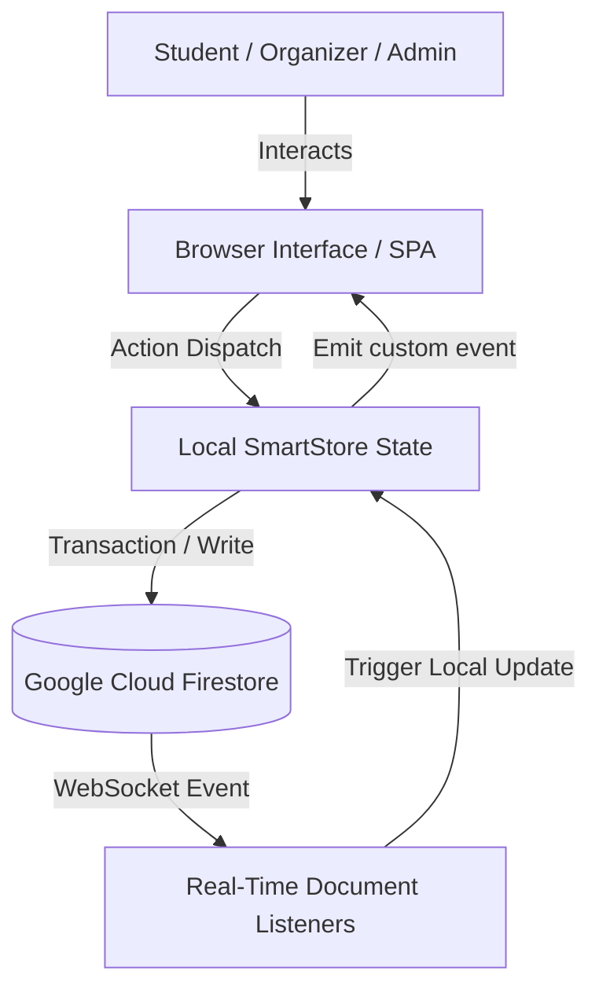

# 🌟 SmartEvent AI — Serverless Event Management Platform

> **A cutting-edge, low-latency event organization, discovery, and administration portal with WebRTC-enabled camera QR validation and real-time state synchronization.**

---

[](LICENSE)
[](https://firebase.google.com)
[](https://developer.mozilla.org/en-US/docs/Web/JavaScript)
[](https://webrtc.org)

SmartEvent AI is a serverless Single Page Application (SPA) designed to streamline the entire event lifecycle. By combining reactive client-side state management with real-time Firebase services, the platform provides instantaneous ticket booking, automatic seat updates, and instant on-site attendance verification using built-in camera-based QR code decoding (no specialized hardware required).

---

## ✨ Features

### 👤 Role-Based Access Control (RBAC)
*   **Students (Attendees):** Browse public events, view live availability counters, register with one click, download `.ics` calendar files, and view/download interactive digital QR tickets.
*   **Organizers:** Access the administrative console, create, edit, or delete events, view active registrant rosters, and open the live camera-based check-in tool.
*   **Administrators:** Global system management, including promoting/demoting user roles (Student, Organizer, Admin) and oversight of all operational parameters.

### ⚡ Zero-Latency Real-Time Sync
Powered by a custom client-side Pub/Sub store (`SmartStore`) hooked directly to Firestore's active WebSocket listeners:
*   Any ticket reservation automatically decrements the event's "Seats Available" count across all active browsers in less than **150ms** without requiring manual page refreshes.
*   Dynamic visual seat trackers with native progress bars provide instant visual feedback on ticket scarcity.

### 📷 WebRTC QR Attendance Check-In
*   Built-in venue ticket validation using pure client-side JavaScript.
*   Uses `navigator.mediaDevices.getUserMedia` to fetch a camera stream, renders frames on a hidden Canvas, and parses UUID ticket payloads via the `jsQR` engine.
*   Includes scan cooldown protection, duplicate scan alerts, and automatic cleanups of hardware streams to prevent battery drain.

---

## 🛠️ Technology Stack

*   **Frontend core:** HTML5 (Semantic Structure) & Vanilla CSS3 (Custom responsive design tokens, glassmorphism, dark-mode styling).
*   **Application Logic:** Vanilla JavaScript (ES6+ modules, async/await, custom window events).
*   **Database & Cloud:** Firebase v10 SDK (Authentication, Cloud Firestore real-time NoSQL, and Firebase Hosting).
*   **Libraries & Utilities:**
    *   [Chart.js](https://www.chartjs.org/) for beautiful, interactive, real-time analytics.
    *   [jsQR](https://github.com/cozmo/jsQR) for super-fast client-side QR code parsing.
    *   [qrcode.js](https://davidshimjs.github.io/qrcodejs/) for high-fidelity canvas QR ticket rendering.

---

## 📐 System Architecture & Data Flow



---

## 📂 Project Structure

```
├── css/
│   └── style.css            # Custom glassmorphic styling system & responsive layout tokens
├── js/
│   ├── app.js               # Global UI coordination, notifications, and modular routing
│   ├── auth.js              # Secure Google OAuth & Email/Password authentication
│   ├── data.js              # Central reactive SmartStore & Firebase integration
│   ├── admin.js             # WebRTC scanning loop, charts visualization, and role edits
│   └── events.js            # Category filters, listings browser, and registration hooks
├── screenshots/             # Interface mockups and visual operational validations
├── firestore.rules          # Granular security policies & RBAC validation rules
├── firebase.json            # Serverless deployment configurations
├── index.html               # Main landing / gateway page
├── dashboard.html           # Core workspace dashboard (Student/Organizer/Admin tabs)
└── project_report.pdf       # 23-page comprehensive technical report
```

---

## 🚀 Local Setup & Configuration

### Prerequisites
*   Node.js (v18+)
*   A modern, evergreen web browser with camera permissions enabled (Chrome, Safari, Firefox, Edge)

### Step 1: Clone the Repository
```bash
git clone https://github.com/Ashutoshsingh20/SmartEvent-AI.git
cd SmartEvent-AI
```

### Step 2: Set Up Firebase Config
Create a file named `js/firebase-config.js` or edit the initialization block in `js/firebase.js` with your active web app credentials from the Firebase Console:
```javascript
export const firebaseConfig = {
  apiKey: "YOUR_API_KEY",
  authDomain: "YOUR_PROJECT_ID.firebaseapp.com",
  projectId: "YOUR_PROJECT_ID",
  storageBucket: "YOUR_PROJECT_ID.appspot.com",
  messagingSenderId: "YOUR_MESSAGING_SENDER_ID",
  appId: "YOUR_APP_ID"
};
```

### Step 3: Serve the Application
You can serve the project locally using a lightweight server, Node environment, or Live Server extension:
```bash
# Using npm serve
npx serve .

# Or using Python 3
python -m http.server 8000
```
Open `http://localhost:8000` in your web browser.

---

## 🔒 Security Policies (Firestore Rules)
All document transactions are strictly verified directly at the database layer. Database structures cannot be accessed bypass-style by unauthorized clients. Below is a snippet of our unified role authorization model:

```javascript
rules_version = '2';
service cloud.firestore {
  match /databases/{database}/documents {
    // Check if user has specific system role
    function hasRole(role) {
      return request.auth != null && 
        get(/databases/$(database)/documents/users/$(request.auth.uid)).data.role == role;
    }
    
    match /events/{eventId} {
      allow read: if true;
      allow write: if hasRole('organizer') || hasRole('admin');
    }
  }
}
```

---

## 📋 Technical Report
A comprehensive 23-page academic report is included in this repository as [project_report.pdf](./project_report.pdf). The report details the complete literature review, structural requirements, system design modeling, database schemas, and exhaustive test tables.
